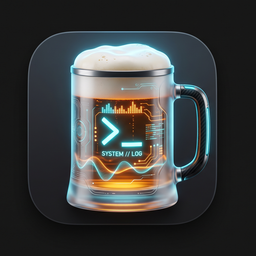

# ⚡ LEITSTAND (라이트슈탄트)

<p align="center">
  <br>
  <a href="README.md"><b>English</b></a> •
  <a href="README.ko.md"><b>한국어</b></a> •
  <a href="README.de.md"><b>Deutsch</b></a>
</p>

<p align="center">
  
  
  
  
</p>

> **Modern, Lightweight & Zero-dependency Terminal Server Cockpit & SFTP Dual-Pane Manager**  
> *An agentless server control center engineered for developers, DevOps, and system engineers.*

---

## 🌟 Overview

**LEITSTAND** (*German for "Control Station / Dispatch Center"*) is a high-performance terminal user interface (TUI) cockpit written in **Go** and powered by the **Charmbracelet Lipgloss & Bubbletea** ecosystem.

It eliminates the need for heavy desktop tools by providing a **fast, single-binary, keyboard-driven cockpit** that connects to any remote Linux/Unix server via standard SSH **without requiring any agent, background daemon, or runtime dependencies on the target machines**.

---

## 🚀 Key Feature Highlights

### 1. 🖥️ 3-Pane Unified Live Cockpit
- **Host Explorer (Left)**: Multi-server fleet list with instant connection health badges (`🟢 Online`, `🔴 Offline`), custom grouping, and SSH connection multiplexing.
- **Telemetry Deck (Top-Right)**: Real-time gauges for **CPU Utilization**, **Memory Usage**, **Disk Space**, and **Live Network I/O Speed** (B/s, KB/s, MB/s) polled on-demand with zero database overhead.
- **Stateful Remote Console (Bottom-Right)**: Full-featured remote shell with working directory tracking, command history, and syntax highlighting.

### 2. 📑 Multi-Tab Stateful Shell
- **Host-Isolated Multi-Tabs**: Open and manage multiple terminal tabs per server (`Ctrl+T` / `Ctrl+N`, `Ctrl+W`, `Alt+1`~`Alt+9`).
- **Independent State Preservation**: Each tab preserves its own working directory (`CWD`), command history (`↑/↓`), and scroll viewport.
- **Asynchronous Live Streaming**: Run streaming jobs (`tail -f /var/log/syslog`, `docker logs -f`, `journalctl -f`, `ping`) in the background with `🔴 LIVE` blinking badges. Cancelling a stream (`Ctrl+C`) stops only that specific job without disconnecting the tab.

### 3. 🛡️ SSH Bastion / Jump Host Tunneling
- **Private Subnet Traversal**: Seamlessly bridge into air-gapped private servers behind corporate firewalls via standard SSH ProxyJump Bastion hosts.
- **Automatic Host Fingerprint Validation**: Real-time SSH key exchange and strict fingerprint verification ensuring tamper-proof tunnel transport.

### 4. 📂 SFTP Dual-Pane File Manager & Clipboard Movement (`[f]`)
- **90% Wide Dual-Pane View**: Local PC (Left) ↔ Remote Server (Right) with instant focus switching (`[Tab]`).
- **Rapid Navigation & Search**: Fast page scrolling (`[PgUp]`/`[PgDn]`, `[Home]`/`[End]`) and real-time filename filter (`[/]`).
- **Clipboard Cut & Paste Movement (`[x]` ➔ Free Navigation ➔ `[p]`)**:
  - **`[x]` / `[Ctrl+X]` (Cut / Stage for Move)**: Stage files into clipboard with `[✂]` badge.
  - **Free Navigation**: Browse anywhere using arrow keys, `[Enter]` (folder entry), and `[Backspace]` (parent directory).
  - **`[p]` / `[Ctrl+V]` (Paste / Drop)**: Fast disk-level `os.Rename` or SFTP move into the currently viewed folder!
  - **`[c]` / `[Ctrl+C]` (Copy)**: Stage files for duplication into any target folder.
- **Batch Transfer with Live Progress**: Multi-select files (`[Space]`, `[a]`) and trigger batch **Upload (`[u]`)** or **Download (`[d]`)** with chunked streaming, progress bars, and MB/s throughput meters.
- **In-Manager Quick Shell Execution (`[:]` / `[!]`)**:
  - Run shell commands (`ls -la`, `cd ..`, `df -h`, `cat`, `chmod`, `tar -xvf`) directly inside the current active directory.
  - `cd` commands automatically synchronize the file manager's directory listing!
- **Safety First**:
  - **Permission Denied Protection**: Automatic rollback with warning banner when attempting to enter inaccessible folders.
  - **Clear Delete Confirmation**: Prompts with the exact filename and type (`🗑️ 'production.db' (file) permanently delete? [y/n]`).
  - **Exit Confirmation Modal**: Guards against accidental exit on `[Esc]`, `[q]`, or `[f]`.

### 5. 🔐 Local Encrypted Master Vault & Security Maintenance (`[p]` Tab 4)
- **Argon2id KDF + AES-256-GCM**: Industry-standard encryption for all server passwords, sudo secrets, and SSH private keys.
- **SSH Private Key Management (`[b]` File Picker)**: In-app browser to discover and load `id_rsa`, `id_ed25519`, and `.pem` keys from `~/.ssh/`.
- **Master Password Rekeying**: Dedicated rekeying workflow in Settings Tab `[4]` that safely re-encrypts all stored host credentials with a new master password.
- **Two-Factor Factory Reset Protection**: Zero-risk maintenance modal requiring master password re-entry before purging data.
- **Caps Lock Detection & Security Badges**: Real-time `[🔒 CAPS LOCK ON]` warning banners to prevent mistyped credentials.

### 6. 🗄️ Database Maintenance & Audit Management (`[p]` Tab 4)
- **Real-Time DB Diagnostics**: Live file size, registered host count, and historical telemetry snapshot statistics.
- **Configurable Retention & Disk Vacuum**: 1-click prune expired metrics (7-day default, 14-day, 30-day) followed by instant SQLite `VACUUM` to reclaim disk space.
- **Audit Export / Import**:
  - **Metrics CSV Export**: Dump historical CPU/RAM/Disk/Network measurements to timestamped CSV files.
  - **Hosts JSON Backup & Restore**: Backup registered hosts to portable JSON and safely restore them with deduplication.

### 7. 🤖 AI Terminal Copilot & Autonomous Diagnostics (`[F4]`)
- **Multi-Provider Support**: Ultra-fast **Groq Cloud API** (free LPU engine), local **Ollama** (offline/private LLM), and **OpenAI** with isolated profile caching per provider.
- **Context-Aware Diagnosis**: Automatically feeds real-time telemetry (CPU/RAM/Disk), OS distro, working directory, and last command exit code/stderr into the LLM context.
- **Dual-Mode Response UX**: Explains root causes for errors in 1-2 clear sentences and provides optimal single-line action commands.
- **1-Click Execution & Tab Edit**: Press `[Enter]` to instantly execute suggested commands on the target server, or `[Tab]` to copy to console for review.
- **Bash-Style History Navigation (`↑ / ↓`)**: Recall previous AI queries, explanations, and suggested commands with arrow keys.
- **Dual-Tier Safety Guardrails**: Strict Linux ops scope enforcement via i18n prompts and hardcoded client-side blocks against destructive commands (`rm -rf`, `shutdown`, etc.).

### 8. 🌐 Multi-Language Localization (i18n)
- 100% native support across **English (Default)**, **한국어 (Korean)**, and **Deutsch (German)** across all UI views, modals, runbooks, and error banners.

### 9. 📖 Modular Runbook & Keyboard Shortcut Cheat Sheet (`[?]`)
- **[1] ⌨️ Shortcuts Guide**: Full-featured in-app shortcut cheat sheet for Server Explorer, Remote Shell, and SFTP File Manager.
- **[2]~[6] OS Runbooks**: Curated, ready-to-run system diagnostics for Common Linux, Ubuntu, RHEL/Rocky, Alpine, and Docker.

### 10. 🧪 Offline Demo Mode (`--demo`)
- Run with `leitstand --demo` to launch a fully functional mock environment with realistic telemetry and simulated server responses without needing live SSH servers.

---

## ⌨️ Keyboard Shortcut Cheat Sheet

### 🖥️ Main Cockpit
| Shortcut | Action |
|---|---|
| **`[↑/↓]`**, **`[j/k]`** | Navigate Server List |
| **`[Enter]`** | Select server and open remote console |
| **`[Tab]`** | Switch focus between Server Explorer and Console |
| **`[a]`** / **`[e]`** / **`[x]`** | Add Server / Edit Server / Delete Server |
| **`[f]`**, **`[F6]`** | Open SFTP Dual-Pane File Manager |
| **`[F4]`** | Open Inline AI Terminal Copilot & Autonomous Diagnostics |
| **`[t]`** | Launch Fullscreen Interactive PTY Terminal |
| **`[Ctrl+O]`** | Toggle Fullscreen Console |
| **`[?]`**, **`[Ctrl+K]`** | Open OS-Aware Quick Command Runbook |
| **`[p]`**, **`[,]`** | Open Settings & Creator Profile Modal |
| **`[Ctrl+T]`** / **`[Ctrl+N]`** | Create New Console Tab |
| **`[Alt+1]` ~ `[Alt+9]`** | Instant Tab Switching |
| **`[Ctrl+W]`** | Close Active Console Tab |
| **`[Ctrl+C]`** | Cancel Running Stream in Active Tab |
| **`[q]`**, **`[Esc]`** | Quit Application |

---

### 📂 SFTP Dual-Pane File Manager (`[f]`)
| Shortcut | Action |
|---|---|
| **`[Tab]`**, **`[◄/►]`** | Switch Active Pane (Local PC ↔ Remote Server) |
| **`[↑/↓]`**, **`[j/k]`** | Navigate File / Folder List (1 row) |
| **`[PgUp/PgDn]`**, **`[Ctrl+U/D]`** | Fast Page Scroll (Skip whole screen) |
| **`[Home/End]`**, **`[g/G]`** | Jump to Top (First item) / Bottom (Last item) |
| **`[/]`** | Real-time Filename Search / Filter |
| **`[Enter]`** | Open Directory (Protected with Auto-Rollback) |
| **`[Backspace]`** | Go to Parent Directory (`..`) |
| **`[Space]`** | Toggle Multi-selection Badge (`[*]`) |
| **`[a]`** | Select / Deselect All Files |
| **`[x]`**, **`[Ctrl+X]`** | **Cut (Stage for Move)**: Navigate freely and press `[p]` |
| **`[c]`**, **`[Ctrl+C]`** | **Copy (Stage for Duplicate)**: Navigate freely and press `[p]` |
| **`[p]`**, **`[Ctrl+V]`** | **Paste (Drop)**: Move/Copy staged files into current folder |
| **`[u]`** | Upload selected files (Local ➔ Remote) |
| **`[d]`** | Download selected files (Remote ➔ Local) |
| **`[:]`**, **`[!]`** | Execute Instant Shell Command in current folder |
| **`[n]`** / **`[N]`** | Create New Folder (`mkdir`) / New File (`touch`) |
| **`[r]`** | Rename Selected File / Folder |
| **`[Delete]`**, **`[Shift+X]`** | Delete Selected Item(s) with Safe Confirmation |
| **`[.]`** | Toggle Hidden Files (`.env`, `.*`) |
| **`[F5]`** | Refresh Directory Listing |
| **`[?]`**, **`[F1]`** | Open Dedicated File Manager Guide |
| **`[Esc]`**, **`[q]`** | Clear Clipboard / Safe Exit Confirmation |

---

## 📦 Download & Quick Start (No Go Installation Required)

You can download pre-compiled, zero-dependency single binaries directly from the [`dist/`](dist/) folder and run LEITSTAND instantly:

| Platform | Architecture | Package Archive | Quick Run |
|---|---|---|---|
| **Windows** | x86_64 (`amd64`) | [**leitstand-v1.0.0-windows-amd64.zip**](dist/leitstand-v1.0.0-windows-amd64.zip) | Double-click `leitstand.exe` or `.\leitstand.exe` |
| **Linux** | x86_64 (`amd64`) | [**leitstand-v1.0.0-linux-amd64.tar.gz**](dist/leitstand-v1.0.0-linux-amd64.tar.gz) ([`.zip`](dist/leitstand-v1.0.0-linux-amd64.zip)) | `tar -xvf ... && ./leitstand` |
| **macOS** | Apple Silicon (`arm64`) | [**leitstand-v1.0.0-darwin-arm64.tar.gz**](dist/leitstand-v1.0.0-darwin-arm64.tar.gz) ([`.zip`](dist/leitstand-v1.0.0-darwin-arm64.zip)) | `tar -xvf ... && ./leitstand` |
| **macOS** | Intel (`amd64`) | [**leitstand-v1.0.0-darwin-amd64.tar.gz**](dist/leitstand-v1.0.0-darwin-amd64.tar.gz) ([`.zip`](dist/leitstand-v1.0.0-darwin-amd64.zip)) | `tar -xvf ... && ./leitstand` |

> [!TIP]
> Try the instant offline demo without connecting to real servers:  
> **Windows (PowerShell)**: `.\leitstand.exe --demo`  
> **Linux / macOS**: `./leitstand --demo`

---

## 🛠️ Installation & Building from Source

### Prerequisites
- **Go 1.22+** installed.
- Any modern ANSI/UTF-8 terminal (Windows Terminal, iTerm2, Alacritty, Kitty, GNOME Terminal, etc.).

### 1. Build for Your Current OS
```bash
# Clone the repository
git clone https://github.com/sorrynthx/leitstand.git
cd leitstand

# Run automated unit tests
go test -v ./...

# Build binary (Linux / macOS)
go build -o leitstand ./cmd/leitstand

# Build binary (Windows PowerShell)
go build -o leitstand.exe ./cmd/leitstand
```

### 2. Cross-Platform Compilation (Zero-CGO Pure Go)
Because LEITSTAND uses a pure Go SQLite engine and zero external C dependencies, you can compile for any OS directly from your workstation without installing toolchains:

```bash
# Linux (amd64)
CGO_ENABLED=0 GOOS=linux GOARCH=amd64 go build -o dist/leitstand-linux ./cmd/leitstand

# macOS Apple Silicon (arm64)
CGO_ENABLED=0 GOOS=darwin GOARCH=arm64 go build -o dist/leitstand-darwin-arm64 ./cmd/leitstand

# Windows (amd64)
CGO_ENABLED=0 GOOS=windows GOARCH=amd64 go build -o dist/leitstand.exe ./cmd/leitstand
```

### 3. Run
```bash
# Windows (PowerShell)
.\leitstand.exe
.\leitstand.exe --demo

# Linux / macOS
./leitstand
./leitstand --demo
```

---

## 🏛️ System Architecture

For a detailed view of our multi-stage architecture and sequence diagrams, refer to [docs/ARCHITECTURE.md](docs/ARCHITECTURE.md).

```text
┌─────────────────────────────────────────────────────────────────────────────┐
│                          Leitstand TUI Frontend                             │
│       (Bubbletea Model-View-Update + Lipgloss Styling + Multi-Tab)          │
├───────────────────┬─────────────────────────┬───────────────────────────────┤
│   Host Explorer   │     Telemetry Deck      │     Remote Command Console    │
│   (Server List)   │ (CPU/RAM/Disk/Net Gauges)│  (Multi-Tab, Stream, Root#)   │
├───────────────────┴─────────────────────────┴───────────────────────────────┤
│              SFTP Dual-Pane File Manager & Clipboard Engine                 │
│      (Local ↔ Remote, Cut/Paste [x]➔[p], Instant Shell [:], Progress)       │
├─────────────────────────────────────────────────────────────────────────────┤
│                           Core Application Layer                            │
├────────────────────────────────┬────────────────────────────────────────────┤
│       SSH Client Pool          │            Telemetry Collector             │
│ (Single TCP Socket/Host Mux)   │   (Agentless /proc & Command Polling)      │
├────────────────────────────────┼────────────────────────────────────────────┤
│       Master Vault Engine      │            Demo Simulator Layer            │
│  (AES-256-GCM + Argon2id Key)  │  (Realistic Mock Engine & Video Demo Mode) │
├────────────────────────────────┼────────────────────────────────────────────┤
│      AI Copilot Engine         │            Bastion Jump Tunnel             │
│ (Groq Cloud / Ollama / OpenAI) │      (SSH ProxyJump Direct-TCP Tunnel)     │
├────────────────────────────────┴────────────────────────────────────────────┤
│                      Local SQLite Storage & Config                          │
│               (Hosts, Credentials, Metric Snapshots, i18n)                  │
└─────────────────────────────────────────────────────────────────────────────┘
```

---

## 👤 Author & Vision

- **Creator**: **Kyunggon Kim (김경곤)**
- **Vision**: Delivering responsive, zero-dependency, developer-first infrastructure tooling that empowers engineers to manage distributed server fleets with speed and clarity.
- **Repository**: [github.com/sorrynthx/leitstand](https://github.com/sorrynthx/leitstand)
- **License**: MIT License

